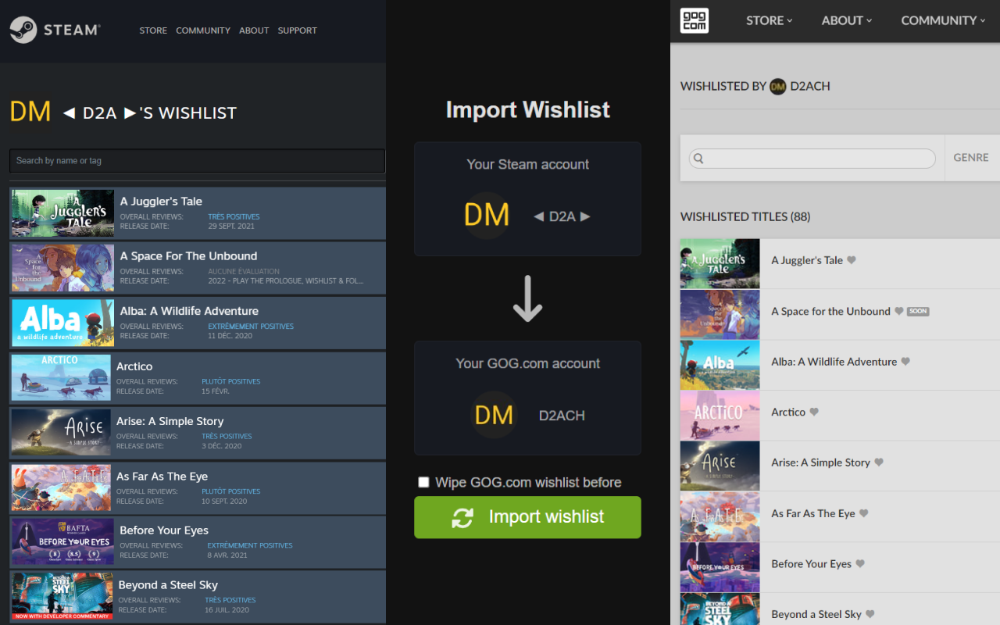

This is a chrome extension that helps you to import your Steam wishlist to your GOG.com account.

## Installation

The extension is available on Chrome Web Store, Microsoft Edge Add-ons and Firefox Add-ons.

